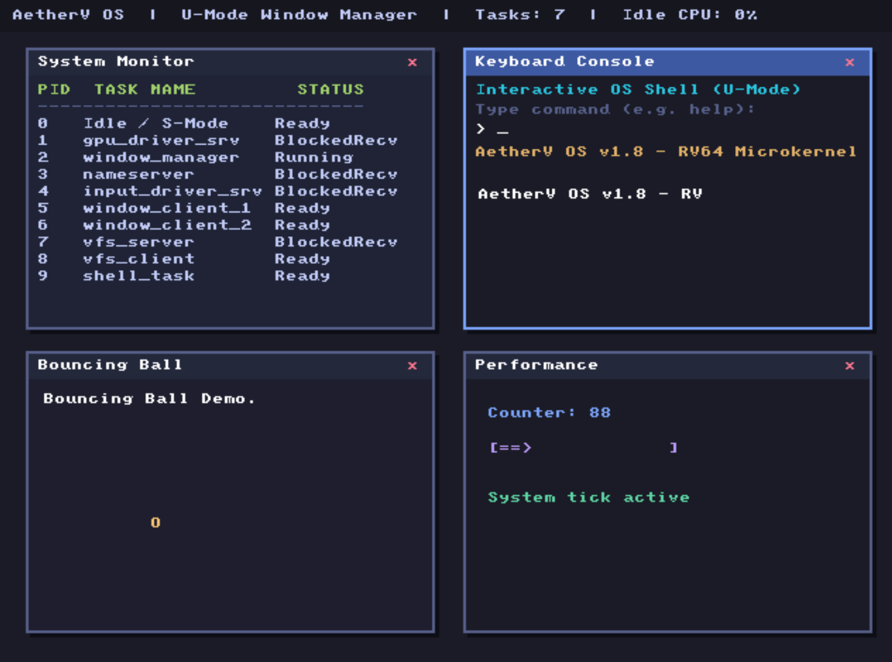

# MicroRust-RISCV 🦀

A minimal, bare-metal RISC-V 64-bit kernel written in Rust (`#![no_std]`, `#![no_main]`). It target the QEMU `virt` machine and boots via OpenSBI (M-mode firmware) into Supervisor Mode (S-mode).

---

## 🚀 Features

- **No Standard Library (`#![no_std]`)**: Runs entirely on bare metal.
- **Custom Entry Point**: Custom bootloader-stub stack setup and BSS zeroing in Assembly/Rust.
- **SBI Console Integration**: Utilizes Supervisor Binary Interface (SBI) Extension `0x01` (`Console Putchar`) for serial debugging.
- **Low-Power Idle**: Suspends the CPU via the `wfi` (Wait For Interrupt) instruction.

---

## 📸 Screenshot

Here is the AetherV OS U-Mode Interactive Shell running and accepting commands:



---


## 🗺️ Memory Map & Boot Details

```
+-------------------+ 0x0000_0000_0000_0000
|     Reserved      |
+-------------------+ 0x0000_0000_1000_0000
|   NS16550A UART   | Base: 0x1000_0000 (Length: 0x100)
+-------------------+ 0x0000_0000_1000_1000
|   VirtIO MMIO     | Base: 0x1000_1000 (Length: 0x4000)
+-------------------+ 0x0000_0000_8000_0000
|  OpenSBI Firmware | Loaded at 0x8000_0000 (M-Mode)
+-------------------+ 0x0000_0000_8020_0000
| Kernel Text/Data  | Base Entry Point: 0x8020_0000 (S-Mode)
+-------------------+ 0x0000_0000_8020_0000 + RAM Size
| Dynamic Heap / RAM| Read/Write Physical Memory
+-------------------+
```

- **Execution Mode**: Supervisor Mode (S-Mode) via OpenSBI.
- **Entry Point**: `0x80200000`.

---

## 🛠️ Prerequisites

1. **Rust Toolchain**:
   Ensure you have Rust installed (via rustup).
2. **Target Architecture Support**:
   ```bash
   rustup target add riscv64gc-unknown-none-elf
   ```
3. **QEMU (RISC-V)**:
   For simulation, you need `qemu-system-riscv64` installed on your machine.

---

## 📦 Building

To compile the bare-metal kernel binary:

```bash
cargo build --release
```

The resulting ELF binary will be generated at `target/riscv64gc-unknown-none-elf/release/microrust-kernel`.

---

## 🎮 Running in QEMU

### Running in Headless Mode (Console Output)
```bash
qemu-system-riscv64 \
    -machine virt \
    -cpu rv64 \
    -m 128M \
    -nographic \
    -bios default \
    -kernel target/riscv64gc-unknown-none-elf/release/microrust-kernel
```

### Running with Graphical Window & VirtIO Input
```bash
qemu-system-riscv64 \
    -machine virt \
    -cpu rv64 \
    -m 256M \
    -bios default \
    -kernel target/riscv64gc-unknown-none-elf/release/microrust-kernel \
    -device virtio-gpu-device \
    -device virtio-keyboard-device \
    -device virtio-mouse-device
```

---

## 📂 Project Structure

- `src/entry.rs` — Assembly startup code setting up the kernel stack.
- `src/sbi.rs` — Rust interface for OpenSBI communication.
- `src/main.rs` — Kernel main entry point and panic handler.
- `linker.ld` — Linker script defining the memory organization.
- `.cargo/config.toml` — Build targets and linking configuration.
