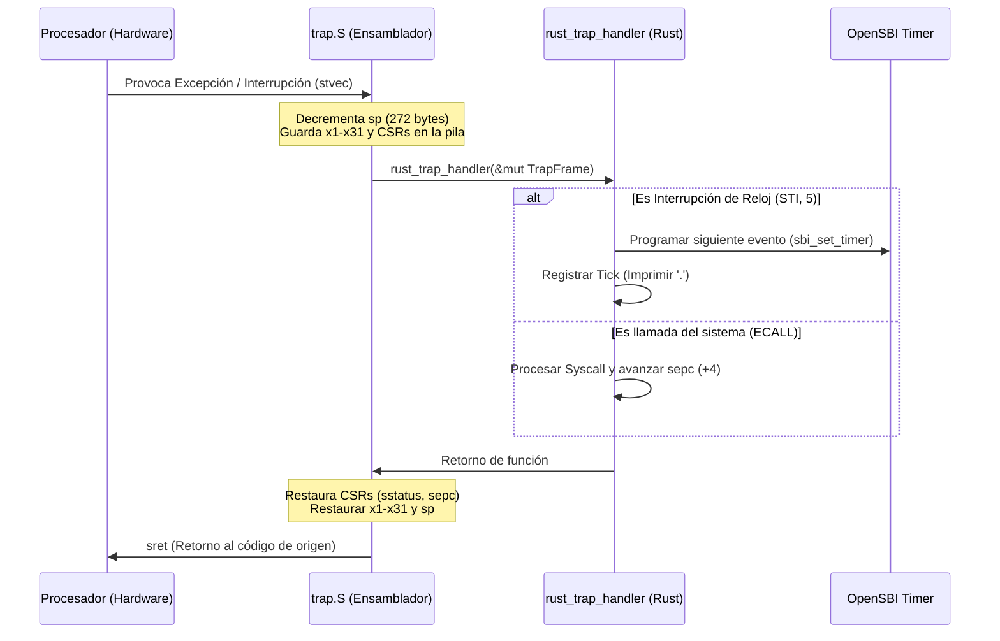

# AetherV OS - Fase 1: Core Foundation (Trap Handling & Paging)

## 🎯 Resumen Ejecutivo
> [!abstract] Resumen
> Especificación técnica detallada y borrador de diseño para la **Fase 1 (Core Foundation)** de AetherV OS. Define el sistema de captura de excepciones e interrupciones temporales mediante extensiones OpenSBI (Módulo 1) y el sistema de traducción de memoria virtual Sv39 (Módulo 2). Este documento actúa como plan de implementación ejecutable para su revisión.

---

## 🔑 Conceptos Clave
- **[[TrapFrame]]:** Estructura en memoria que almacena de forma contigua los 32 registros de propósito general de la CPU RISC-V, además de los registros de control `sstatus` y `sepc`, permitiendo reanudar el hilo de ejecución original tras una interrupción.
- **[[stvec (Supervisor Trap Vector)]]:** Registro CSR que almacena la dirección base del manejador de excepciones en modo supervisor. Tiene dos modos de alineación: Directo (todas las excepciones saltan a la base) y Vectorizado (cada tipo de interrupción salta a un desplazamiento diferente).
- **[[sepc (Supervisor Exception Program Counter)]]:** Registro CSR que almacena la dirección de la instrucción que provocó la excepción o que fue interrumpida.
- **[[scause (Supervisor Cause Register)]]:** Registro CSR que indica la naturaleza de la trampa. El bit más significativo (bit 63 en RV64) determina si es una interrupción (1) o una excepción (0).
- **[[Sv39 Paging]]:** Esquema de memoria virtual para plataformas RISC-V de 64 bits en el cual se usa una dirección virtual de 39 bits estructurada en tres niveles de directorios de páginas (VPN[2], VPN[1], VPN[0]) para mapear a una dirección física de 56 bits.
- **[[PTE (Page Table Entry)]]:** Descriptor de 64 bits que compone las tablas de páginas. Contiene el PPN (Número de Página Física) y los bits de control/permiso (`V`, `R`, `W`, `X`, `U`, `G`, `A`, `D`).
- **[[satp (Supervisor Address Translation and Protection)]]:** Registro CSR que activa la paginación de memoria y apunta a la tabla raíz de páginas física (nivel 2), configurando el modo de traducción (Sv39).

---

## 💡 Especificaciones Técnicas de Implementación

### Módulo 1: Sistema de Trampas (Branch `feature/01-trap-handler`)

Para procesar interrupciones y excepciones, necesitamos guardar los registros en el stack del kernel antes de ceder el control a Rust, y luego restaurarlos de forma idéntica.

#### 1. Estructura `TrapFrame` (Rust)
Definiremos la estructura del marco de trampa de manera que coincida exactamente con el layout de offsets en ensamblador:

```rust
// En src/trap.rs o src/main.rs
#[repr(C)]
#[derive(Debug, Copy, Clone)]
pub struct TrapFrame {
    pub regs: [usize; 32], // Registros x0 a x1 (x0 es dummy, guardado para consistencia de índices)
    pub sstatus: usize,    // Estado del procesador
    pub sepc: usize,       // Contador de programa al momento del trap
}
```

#### 2. Guardado de Contexto `src/trap.S` (Assembly)
Implementaremos el punto de entrada de bajo nivel que preserva los 32 registros generales y los CSR clave. Cada registro tiene 8 bytes (64 bits). 34 elementos * 8 bytes = 272 bytes (alineado a 16 bytes para la pila).

```assembly
# En src/trap.S (debe compilarse como parte del build)
.section .text
.global trap_entry
.align 4
trap_entry:
    # 1. Reservar espacio en la pila del kernel para el TrapFrame (34 * 8 = 272 bytes)
    addi sp, sp, -272

    # 2. Guardar todos los registros generales (excepto x0 y sp)
    sd x1, 8(sp)
    # x2 es sp, lo guardamos manualmente después leyendo el valor original
    sd x3, 24(sp)
    sd x4, 32(sp)
    sd x5, 40(sp)
    sd x6, 48(sp)
    sd x7, 56(sp)
    sd x8, 64(sp)
    sd x9, 72(sp)
    sd x10, 80(sp)
    sd x11, 88(sp)
    sd x12, 96(sp)
    sd x13, 104(sp)
    sd x14, 112(sp)
    sd x15, 120(sp)
    sd x16, 128(sp)
    sd x17, 136(sp)
    sd x18, 144(sp)
    sd x19, 152(sp)
    sd x20, 160(sp)
    sd x21, 168(sp)
    sd x22, 176(sp)
    sd x23, 184(sp)
    sd x24, 192(sp)
    sd x25, 200(sp)
    sd x26, 208(sp)
    sd x27, 216(sp)
    sd x28, 224(sp)
    sd x29, 232(sp)
    sd x30, 240(sp)
    sd x31, 248(sp)

    # Calcular y guardar el sp original (antes de restar 272)
    addi t0, sp, 272
    sd t0, 16(sp)

    # 3. Leer y guardar CSRs de control del Trap
    csrr t0, sstatus
    sd t0, 256(sp)
    csrr t1, sepc
    sd t1, 264(sp)

    # 4. Pasar puntero de TrapFrame (a0 = sp) al manejador de Rust
    mv a0, sp
    call rust_trap_handler

.global trap_return
trap_return:
    # 5. Restaurar CSRs
    ld t0, 256(sp)
    csrw sstatus, t0
    ld t1, 264(sp)
    csrw sepc, t1

    # 6. Restaurar registros generales (excepto sp)
    ld x1, 8(sp)
    # x2 (sp) será restaurado al final
    ld x3, 24(sp)
    ld x4, 32(sp)
    ld x5, 40(sp)
    ld x6, 48(sp)
    ld x7, 56(sp)
    ld x8, 64(sp)
    ld x9, 72(sp)
    ld x10, 80(sp)
    ld x11, 88(sp)
    ld x12, 96(sp)
    ld x13, 104(sp)
    ld x14, 112(sp)
    ld x15, 120(sp)
    ld x16, 128(sp)
    ld x17, 136(sp)
    ld x18, 144(sp)
    ld x19, 152(sp)
    ld x20, 160(sp)
    ld x21, 168(sp)
    ld x22, 176(sp)
    ld x23, 184(sp)
    ld x24, 192(sp)
    ld x25, 200(sp)
    ld x26, 208(sp)
    ld x27, 216(sp)
    ld x28, 224(sp)
    ld x29, 232(sp)
    ld x30, 240(sp)
    ld x31, 248(sp)

    # 7. Restaurar pila y retornar del modo Supervisor
    addi sp, sp, 272
    sret
```

#### 3. Ruteador en Rust `src/trap.rs`
El ruteador recibirá el puntero mutable a `TrapFrame`, analizará `scause` y gestionará el evento:

```rust
// En src/trap.rs
use crate::sbi;

#[no_mangle]
pub extern "C" fn rust_trap_handler(tf: &mut TrapFrame) {
    let scause: usize;
    let stval: usize;
    unsafe {
        core::arch::asm!("csrr {}, scause", out(reg) scause);
        core::arch::asm!("csrr {}, stval", out(reg) stval);
    }

    let is_interrupt = (scause >> 63) != 0;
    let code = scause & !(1 << 63);

    if is_interrupt {
        match code {
            5 => { // Supervisor Timer Interrupt (STI)
                handle_timer_interrupt();
            }
            _ => {
                sbi::print_str("\n[Trap] Interrupción no controlada: ");
                // Imprimir info de depuración
            }
        }
    } else {
        match code {
            9 => { // Environment Call desde S-mode (Simulación de syscalls)
                sbi::print_str("\n[Syscall] ECALL desde S-mode detectado.");
                tf.sepc += 4; // Avanzar sepc para evitar bucle de ecall
            }
            2 => {
                panic!("Instrucción ilegal detectada en 0x{:X}", tf.sepc);
            }
            12 | 13 | 15 => {
                panic!("Fallo de página (código {}) en 0x{:X}, dirección de fallo: 0x{:X}", code, tf.sepc, stval);
            }
            _ => {
                panic!("Excepción fatal. Código: {}, sepc: 0x{:X}, stval: 0x{:X}", code, tf.sepc, stval);
            }
        }
    }
}

// Inicialización de trampas
pub fn init() {
    extern "C" {
        fn trap_entry();
    }
    unsafe {
        // Modo Directo: stvec = trap_entry (últimos dos bits en 00 para modo directo)
        let trap_entry_addr = trap_entry as usize;
        core::arch::asm!("csrw stvec, {}", in(reg) trap_entry_addr);
    }
}
```

#### 4. Reloj Periódico vía OpenSBI
Habilitaremos el temporizador utilizando los ticks del reloj del procesador RISC-V:

```rust
// En src/sbi.rs
#[inline(always)]
pub fn sbi_set_timer(time: u64) {
    unsafe {
        core::arch::asm!(
            "li a7, 0x54494D45", // Timer Extension
            "li a6, 0",          // Function ID (Set Timer)
            "ecall",
            in("a0") time,
            out("a7") _,
            out("a6") _,
        );
    }
}

#[inline(always)]
pub fn get_time() -> u64 {
    let time: usize;
    unsafe {
        core::arch::asm!("csrr {}, time", out(reg) time);
    }
    time as u64
}
```

En `src/trap.rs`, para tener ticks periódicos (ej. cada 10ms), necesitamos programar el siguiente evento:
```rust
const TIMER_INTERVAL: u64 = 100_000; // Ajustar según frecuencia del reloj simulado en QEMU

fn handle_timer_interrupt() {
    sbi::print_str("."); // Visualizar los ticks
    sbi_set_timer(get_time() + TIMER_INTERVAL);
}

pub fn enable_timer_interrupt() {
    unsafe {
        // Habilitar Timer Interrupts en sie (Supervisor Interrupt Enable, bit 5 es STIE)
        core::arch::asm!("csrs sie, {}", in(reg) (1 << 5));
        // Habilitar interrupciones globales en sstatus (bit 1 es SIE)
        core::arch::asm!("csrs sstatus, {}", in(reg) (1 << 1));
    }
    // Programar primer evento
    sbi_set_timer(get_time() + TIMER_INTERVAL);
}
```

---

### Módulo 2: Memoria Virtual y Paginación Sv39 (Branch `feature/02-sv39-paging`)

Sv39 mapea 512 GB de espacio virtual. Cada página base tiene un tamaño de 4 KiB. El directorio de páginas tiene 3 niveles (L2 -> L1 -> L0).

#### 1. Formato de Tabla de Páginas y PTE
Un PTE Sv39 en Rust se define de la siguiente manera:

```rust
// En src/paging.rs
#[derive(Copy, Clone)]
#[repr(transparent)]
pub struct PTE(u64);

impl PTE {
    pub fn new() -> Self { PTE(0) }
    pub fn is_valid(&self) -> bool { (self.0 & 1) != 0 }
    pub fn set_valid(&mut self, valid: bool) {
        if valid { self.0 |= 1; } else { self.0 &= !1; }
    }
    pub fn get_ppn(&self) -> usize {
        ((self.0 >> 10) & 0x3FFFFFFFFFFFF) as usize
    }
    pub fn set_ppn(&mut self, ppn: usize) {
        self.0 &= !(0x3FFFFFFFFFFFF << 10);
        self.0 |= (ppn as u64 & 0x3FFFFFFFFFFFF) << 10;
    }
    pub fn set_flags(&mut self, flags: u8) {
        self.0 &= !0xFF;
        self.0 |= flags as u64;
    }
    pub fn get_table_ptr(&self) -> *mut PageTable {
        (self.get_ppn() << 12) as *mut PageTable
    }
}

#[repr(align(4096))]
pub struct PageTable {
    pub entries: [PTE; 512],
}

impl PageTable {
    pub const fn new() -> Self {
        PageTable { entries: [PTE(0); 512] }
    }
}
```

#### 2. Asignador Inicial de Páginas Físicas (`SimpleFrameAllocator`)
Para construir las tablas de páginas L1 y L0 sobre la marcha, necesitamos memoria dinámica. Un bump-allocator de páginas físicas simple que empiece después del kernel es ideal:

```rust
// En src/paging.rs
pub struct SimpleFrameAllocator {
    current_addr: usize,
    end_addr: usize,
}

impl SimpleFrameAllocator {
    pub fn new(start: usize, end: usize) -> Self {
        Self {
            current_addr: (start + 4095) & !4095, // Alinear a 4KB
            end_addr: end,
        }
    }

    pub fn alloc(&mut self) -> Option<usize> {
        if self.current_addr + 4096 <= self.end_addr {
            let addr = self.current_addr;
            self.current_addr += 4096;
            Some(addr)
        } else {
            None
        }
    }
}
```

#### 3. Algoritmo de Traducción y Mapeo (`map_page`)
La lógica para mapear una dirección virtual (VA) a una física (PA) recorriendo los 3 niveles:

```rust
// En src/paging.rs
pub fn map_page(
    root: &mut PageTable,
    va: usize,
    pa: usize,
    flags: u8,
    allocator: &mut SimpleFrameAllocator
) {
    let vpn = [
        (va >> 12) & 0x1FF, // VPN[0]
        (va >> 21) & 0x1FF, // VPN[1]
        (va >> 30) & 0x1FF, // VPN[2]
    ];

    let mut current_table = root as *mut PageTable;

    // Recorrer L2 y L1
    for level in (1..=2).rev() {
        let entry = unsafe { &mut (*current_table).entries[vpn[level]] };
        if !entry.is_valid() {
            // Reservar una página física para la subtabla
            let new_table_pa = allocator.alloc().expect("OOM asignando tabla de páginas");
            // Limpiar la página asignada
            unsafe { core::ptr::write_bytes(new_table_pa as *mut u8, 0, 4096); }
            entry.set_ppn(new_table_pa >> 12);
            entry.set_valid(true);
        }
        current_table = entry.get_table_ptr();
    }

    // Mapear en L0 (Hoja)
    let entry = unsafe { &mut (*current_table).entries[vpn[0]] };
    entry.set_ppn(pa >> 12);
    // Asegurar los bits de Accessed (A = 0x20) y Dirty (D = 0x40) para evitar excepciones inmediatas
    entry.set_flags(flags | 0x20 | 0x40);
    entry.set_valid(true);
}

pub fn map_range(
    root: &mut PageTable,
    start_va: usize,
    start_pa: usize,
    size: usize,
    flags: u8,
    allocator: &mut SimpleFrameAllocator
) {
    let pages = (size + 4095) / 4096;
    for i in 0..pages {
        map_page(root, start_va + i * 4096, start_pa + i * 4096, flags, allocator);
    }
}
```

#### 4. Diseño del Mapa de Memoria e Identity Mapping
Mapearemos las regiones clave en relación 1:1 (Dirección Virtual = Dirección Física) para evitar que el PC (Program Counter) pierda consistencia al habilitar la paginación.

| Región | Dirección Base (PA) | Dirección Límite (PA) | Permisos Sv39 | Propósito |
| :--- | :--- | :--- | :--- | :--- |
| **UART MMIO** | `0x1000_0000` | `0x1000_0100` | `R` (Read) + `W` (Write) | Salida a consola UART |
| **VirtIO MMIO** | `0x1000_1000` | `0x1000_5000` | `R` (Read) + `W` (Write) | Entrada/Salida a Dispositivos |
| **OpenSBI / Boot** | `0x8000_0000` | `0x8020_0000` | `R` + `X` (Execute) | Llamadas de firmware (M-Mode) |
| **Kernel Text** | `stext` | `etext` | `R` + `X` (Execute) | Código de ejecución del Kernel |
| **Kernel Rodata**| `srodata` | `erodata` | `R` (Read) | Constantes y texto estático |
| **Kernel Data/Bss**| `sdata` | `ekernel` | `R` + `W` (Write) | Variables globales y pila |
| **Free Memory** | `ekernel` | `0x8800_0000` | `R` + `W` (Write) | Heap dinámico y tablas de páginas |

#### 5. Modificación de `linker.ld`
Para obtener las direcciones exactas de las secciones, modificaremos el archivo de enlazado `linker.ld`:

```ld
OUTPUT_ARCH(riscv)
ENTRY(_start)

BASE_ADDRESS = 0x80200000;

SECTIONS
{
    . = BASE_ADDRESS;

    .text : {
        stext = .;
        *(.text.init)
        *(.text .text.*)
        etext = .;
    }

    .rodata : {
        srodata = .;
        *(.rodata .rodata.*)
        erodata = .;
    }

    .data : {
        sdata = .;
        *(.data .data.*)
        edata = .;
    }

    .bss : {
        sbss = .;
        *(.bss .bss.*)
        *(COMMON)
        ebss = .;
    }
    
    . = ALIGN(4096);
    ekernel = .;
}
```

#### 6. Activación de Paginación (`satp` & `sfence.vma`)
Para habilitar el sistema de traducción, debemos escribir el registro `satp` y luego limpiar el TLB de la CPU:

```rust
// En src/paging.rs
pub unsafe fn enable_paging(root_table_pa: usize) {
    let mode_sv39 = 8usize;
    // satp: [Mode: 63-60] [ASID: 59-44] [PPN: 43-0]
    let satp_val = (mode_sv39 << 60) | (root_table_pa >> 12);
    
    core::arch::asm!(
        "csrw satp, {}",
        "sfence.vma",
        in(reg) satp_val
    );
}
```

---

## Diagramas y Esquemas

### Flujo del Sistema de Trampas (Trap Handler Flow)



### Esquema de Paginación Sv39

```mermaid
graph TD
    VA[Dirección Virtual de 39 bits] --> VPN2[VPN[2]: bits 38-30]
    VA --> VPN1[VPN[1]: bits 29-21]
    VA --> VPN0[VPN[0]: bits 20-12]
    VA --> Offset[Offset: bits 11-0]

    subgraph Directorio de Páginas
        SATP[satp.PPN] --> L2[Root Table L2 - 512 Entradas]
        VPN2 -->|Indexa L2| L2_Entry[PTE L2]
        L2_Entry -->|Puntero PPN| L1[Table L1 - 512 Entradas]
        VPN1 -->|Indexa L1| L1_Entry[PTE L1]
        L1_Entry -->|Puntero PPN| L0[Table L0 - 512 Entradas]
        VPN0 -->|Indexa L0| L0_Entry[PTE L0 - Hoja]
    end

    L0_Entry -->|PPN Física| PA[Dirección Física de 56 bits]
    Offset -->|Desplazamiento directo| PA
```

---

## 📌 Citas Destacadas
> [!IMPORTANT] Coherencia de Identidad
> "El uso de *Identity Mapping* (mapeo uno a uno) es crucial en la inicialización del núcleo. Activar la paginación cambia instantáneamente la forma en que la CPU resuelve las direcciones; sin este mapeo, la siguiente instrucción del PC tras escribir en `satp` apuntaría a un área de memoria virtual inválida o desalineada, provocando un fallo de página inmediato e irrecuperable (*Instruction Page Fault*)."

---

## 🛠️ Acciones / Plan de Implementación

- [ ] **Paso 1: Setup de Control de Ramas en Git**
  - Crear e integrar las ramas ordenadamente: `feature/01-trap-handler` y `feature/02-sv39-paging`.
- [ ] **Paso 2: Desarrollar Módulo 1 (Trap Handler)**
  - [ ] Crear el archivo [trap.S](file:///home/carlos/PARA/2-frecuente/00/AetherV/src/trap.S) con la macro de guardado y restauración de registros.
  - [ ] Crear [trap.rs](file:///home/carlos/PARA/2-frecuente/00/AetherV/src/trap.rs) y declarar las funciones de ruteo de interrupciones de reloj y excepciones.
  - [ ] Modificar [sbi.rs](file:///home/carlos/PARA/2-frecuente/00/AetherV/src/sbi.rs) para incluir `sbi_set_timer` y `get_time`.
  - [ ] Integrar la inicialización `trap::init()` y `trap::enable_timer_interrupt()` en `rust_main` dentro de [main.rs](file:///home/carlos/PARA/2-frecuente/00/AetherV/src/main.rs).
  - [ ] **Verificación 1**: Compilar y correr en QEMU. Deberían aparecer puntos `.` en consola de forma periódica, demostrando que los ticks del temporizador RISC-V están siendo interceptados correctamente en modo S.
- [ ] **Paso 3: Desarrollar Módulo 2 (Paginación Sv39)**
  - [ ] Modificar [linker.ld](file:///home/carlos/PARA/2-frecuente/00/AetherV/linker.ld) para definir `stext`, `etext`, `srodata`, `erodata`, `sdata`, y `ekernel`.
  - [ ] Crear [paging.rs](file:///home/carlos/PARA/2-frecuente/00/AetherV/src/paging.rs) con las estructuras `PTE`, `PageTable` e implementar `SimpleFrameAllocator`.
  - [ ] Escribir la lógica de recorrido y mapeo `map_page` y `map_range`.
  - [ ] Instanciar la tabla raíz y realizar el mapeo de identidad para la UART, VirtIO, código del kernel, sección de sólo lectura, datos del núcleo y memoria dinámica.
  - [ ] Invocar a `enable_paging` al final de `rust_main` en [main.rs](file:///home/carlos/PARA/2-frecuente/00/AetherV/src/main.rs).
  - [ ] **Verificación 2**: Compilar y ejecutar. El kernel debe arrancar, activar la paginación sin crasheos de memoria, y poder seguir imprimiendo logs a través de la UART mapeada en memoria virtual.

---

## 🔗 Notas Relacionadas
- [Roadmap de AetherV OS](file:///home/carlos/PARA/2-frecuente/00/AetherV/AetherV_OS_Roadmap.md)
- [Punto de Entrada en Ensamblador](file:///home/carlos/PARA/2-frecuente/00/AetherV/src/entry.rs)
- [Módulo de Llamadas ABI OpenSBI](file:///home/carlos/PARA/2-frecuente/00/AetherV/src/sbi.rs)
- [Función Principal del Kernel](file:///home/carlos/PARA/2-frecuente/00/AetherV/src/main.rs)
- [Script de Enlazado del Kernel](file:///home/carlos/PARA/2-frecuente/00/AetherV/linker.ld)
