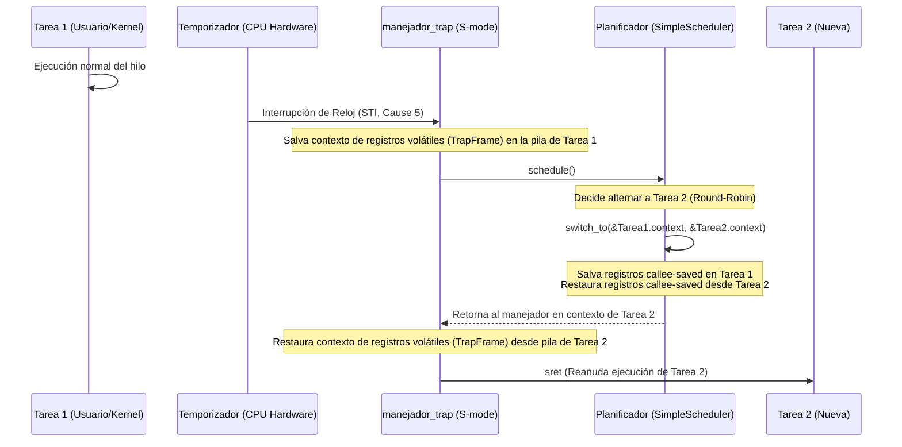

# AetherV OS - Fase 2: Multitasking & User Space (Planificación)

## 🎯 Resumen Ejecutivo
> [!abstract] Resumen
> Plan de diseño y especificación para la **Fase 2: Multitasking & User Space** de AetherV OS. Cubre la creación del Planificador Round-Robin preventivo guiado por interrupciones de temporizador y llamadas al sistema (Módulo 1: `feature/03-preemptive-sched`) y la inclusión de un parser del Flattened Device Tree (FDT) para autodescubrimiento de hardware (Módulo 2: `feature/04-devicetree-parser`).

---

## 🔑 Conceptos Clave
- **[[PCB (Process/Task Control Block)]]:** Estructura que mantiene el estado, identificador, pila y contexto guardado de un hilo o proceso en el núcleo.
- **[[Contexto de Tarea (Task Context)]]:** Conjunto de registros que se deben salvar únicamente durante un cambio voluntario o planificado de contexto. En RISC-V C-ABI, esto incluye los registros preservados por el callee (`ra`, `sp`, `s0` a `s11`).
- **[[Cooperación vs Preención]]:** La multiprogramación cooperativa cede voluntariamente la CPU (`sys_yield`). La multiprogramación preventiva (preemptive) interrumpe la tarea mediante una señal de hardware (temporizador) para obligar al cambio de contexto.
- **[[FDT (Flattened Device Tree) / DTB]]:** Estructura jerárquica binaria compacta con la que el firmware (OpenSBI) informa al Kernel sobre la topología del hardware (CPUs, UART, RAM, MMIO).
- **[[U-Mode (User Privilege Mode)]]:** Modo de menor privilegio (Anillo 3) donde las aplicaciones corren de forma aislada sin acceso directo a instrucciones privilegiadas o registros MMIO físicos.

---

## 💡 Especificación de Diseño de Módulos

### Módulo 1: Planificador Multitarea (`feature/03-preemptive-sched`)

Este módulo introduce hilos del kernel y, eventualmente, aislamiento de espacio de usuario.

#### 1. Estructura de Contexto y PCB
Definiremos los registros que deben persistir al alternar tareas. Los registros temporales no se salvan en el cambio de contexto cooperativo ya que el compilador asume que se pierden tras una llamada a función:

```rust
// En src/task.rs
#[derive(Copy, Clone, PartialEq, Eq, Debug)]
pub enum TaskStatus {
    Unused,
    Ready,
    Running,
    Blocked,
    Exited,
}

#[repr(C)]
#[derive(Clone, Copy, Debug)]
pub struct TaskContext {
    pub ra: usize,       // Dirección de retorno (Return Address)
    pub sp: usize,       // Puntero de pila (Stack Pointer)
    pub s: [usize; 12],  // Registros salvados por el callee (s0 - s11)
}

impl TaskContext {
    pub const fn zero() -> Self {
        Self { ra: 0, sp: 0, s: [0; 12] }
    }
}

pub struct Task {
    pub id: usize,
    pub kstack: [u8; 4096], // Pila de kernel exclusiva
    pub context: TaskContext,
    pub status: TaskStatus,
}
```

#### 2. Cambio de Contexto en Ensamblador (`switch_to`)
Implementaremos la conmutación de registros en ensamblador:

```assembly
# En src/switch.S
.section .text
.global switch_to
.align 4
switch_to:
    # a0: Puntero al TaskContext de la tarea antigua (destino de guardado)
    # a1: Puntero al TaskContext de la tarea nueva (origen de restauración)

    # 1. Guardar registros preservados de la tarea antigua
    sd ra, 0(a0)
    sd sp, 8(a0)
    sd s0, 16(a0)
    sd s1, 24(a0)
    sd s2, 32(a0)
    sd s3, 40(a0)
    sd s4, 48(a0)
    sd s5, 56(a0)
    sd s6, 64(a0)
    sd s7, 72(a0)
    sd s8, 80(a0)
    sd s9, 88(a0)
    sd s10, 96(a0)
    sd s11, 104(a0)

    # 2. Restaurar registros preservados de la nueva tarea
    ld ra, 0(a1)
    ld sp, 8(a1)
    ld s0, 16(a1)
    ld s1, 24(a1)
    ld s2, 32(a1)
    ld s3, 40(a1)
    ld s4, 48(a1)
    ld s5, 56(a1)
    ld s6, 64(a1)
    ld s7, 72(a1)
    ld s8, 80(a1)
    ld s9, 88(a1)
    ld s10, 96(a1)
    ld s11, 104(a1)

    ret
```

#### 3. Planificador Round-Robin
El planificador recorrerá circularmente las tareas buscando la siguiente en estado `Ready`:

```rust
// En src/task.rs
const MAX_TASKS: usize = 4;

pub struct SimpleScheduler {
    pub tasks: [Task; MAX_TASKS],
    pub current_id: usize,
}

impl SimpleScheduler {
    pub fn schedule(&mut self) {
        let current_idx = self.current_id;
        let mut next_idx = (current_idx + 1) % MAX_TASKS;

        // Buscar siguiente tarea disponible
        while next_idx != current_idx {
            if self.tasks[next_idx].status == TaskStatus::Ready {
                break;
            }
            next_idx = (next_idx + 1) % MAX_TASKS;
        }

        if self.tasks[next_idx].status != TaskStatus::Ready {
            return; // Seguir ejecutando la misma tarea si no hay otra lista
        }

        // Realizar el cambio de contexto
        let old_task_ptr = &mut self.tasks[current_idx].context as *mut TaskContext;
        let new_task_ptr = &self.tasks[next_idx].context as *const TaskContext;

        self.tasks[current_idx].status = TaskStatus::Ready;
        self.tasks[next_idx].status = TaskStatus::Running;
        self.current_id = next_idx;

        unsafe {
            extern "C" {
                fn switch_to(old: *mut TaskContext, new: *const TaskContext);
            }
            switch_to(old_task_ptr, new_task_ptr);
        }
    }
}
```

#### 4. Integración con Interrupción de Reloj y Syscalls
Para conseguir preención, en `rust_trap_handler`, cuando ocurra la interrupción STI (`code = 5`), invocaremos al planificador para forzar el cambio de hilo:

```rust
// En src/trap.rs
fn handle_timer_interrupt() {
    sbi::print_str(".");
    sbi::sbi_set_timer(sbi::get_time() + TIMER_INTERVAL);
    
    // Llamar al planificador para cambiar de tarea (Preemptive context switch)
    unsafe {
        crate::task::SCHEDULER.schedule();
    }
}
```

Para las syscalls, interceptaremos `ecall` de espacio de usuario/supervisor y enrutaremos por el registro `a7`:
- `a7 = 1` -> `sys_yield`: Entrega voluntaria de la CPU.
- `a7 = 2` -> `sys_exit`: Finalización de la tarea.
- `a7 = 3` -> `sys_write`: Imprime en la consola UART.

---

### Módulo 2: Parser de Árbol de Dispositivos (`feature/04-devicetree-parser`)

El firmware OpenSBI pasa un puntero físico al binario del árbol de dispositivos (DTB/FDT) en el registro `a1` al arrancar.

#### 1. Cabecera del Flattened Device Tree
La cabecera del árbol binario contiene offsets para ubicar nodos y propiedades:

```rust
// En src/fdt.rs
#[repr(C)]
#[derive(Debug)]
pub struct FdtHeader {
    pub magic: u32,             // Magic number (0xd00dfeed en big-endian)
    pub totalsize: u32,         // Tamaño total de la estructura
    pub off_dt_struct: u32,     // Offset a la estructura de tokens
    pub off_dt_strings: u32,    // Offset a la tabla de cadenas de caracteres
    pub off_mem_rsvmap: u32,    // Offset al mapa de memoria reservada
    pub version: u32,           // Versión del formato
    pub last_comp_version: u32, // Última versión compatible
    pub boot_cpuid_phys: u32,   // CPU ID físico de arranque
    pub size_dt_strings: u32,   // Tamaño de la tabla de strings
    pub size_dt_struct: u32,    // Tamaño de la tabla de estructuras
}
```

#### 2. Lógica del Parser Liviano (Zero-Allocation Parser)
Dada la falta de una biblioteca estándar completa, procesaremos los tokens del binario FDT directamente sobre su puntero de memoria en Big-Endian (convirtiendo con `u32::from_be`):

- **FDT_BEGIN_NODE (0x00000001):** Marca el inicio de un nodo. Va seguido por su nombre alineado a 4 bytes.
- **FDT_END_NODE (0x00000002):** Fin del nodo actual.
- **FDT_PROP (0x00000003):** Propiedad del nodo. Contiene la longitud de los datos (`len`), el offset en la tabla de strings para su nombre (`nameoff`), y el valor alineado a 4 bytes.
- **FDT_NOP (0x00000004):** Ignorado.
- **FDT_END (0x00000009):** Fin del árbol binario.

El parser recorrerá el árbol buscando:
1. Nodos de CPU (`/cpus`) para contar los cores (`harts`) disponibles.
2. Dirección base UART (`/soc/uart@10000000`) para validar nuestra inicialización estática de consola.
3. Región de memoria (`/memory@80000000`) para leer dinámicamente el tamaño de la RAM instalada en QEMU.

---

## Diagramas y Esquemas

### Flujo del Cambio de Contexto Preventivo (Preemptive Context Switch)



---

## 🛠️ Acciones / Plan de Implementación de la Fase 2

- [ ] **Paso 1: Crear e Implementar Rama `feature/03-preemptive-sched`**
  - [ ] Crear el archivo ensamblador `src/switch.S` para definir la función `switch_to`.
  - [ ] Desarrollar `src/task.rs` definiendo las pilas independientes, el struct `Task` y el planificador Round-Robin.
  - [ ] Modificar `src/trap.rs` para realizar la llamada de planificación al capturar interrupciones de temporizador y manejar `ecall` de S-mode.
  - [ ] **Verificación 1:** Inicializar dos tareas concurrentes que impriman caracteres diferentes (ej. `A` y `B`). Confirmar que se alternan periódicamente por ticks del reloj.
- [ ] **Paso 2: Crear e Implementar Rama `feature/04-devicetree-parser`**
  - [ ] Crear `src/fdt.rs` para procesar el puntero de memoria del árbol de dispositivos (pasado por OpenSBI en `a1`).
  - [ ] Modificar `rust_main` en `src/main.rs` para capturar el argumento `_fdt_ptr` y pasarlo al parser.
  - [ ] **Verificación 2:** Arrancar QEMU con diferentes cantidades de CPUs y RAM (ej. `-smp 4 -m 256M`). Verificar que el parser lea e imprima correctamente los cores activos y el mapa de memoria.

---

## 🔗 Notas Relacionadas
- [aetherv_phase1_okf.md](file:///home/carlos/PARA/2-frecuente/00/AetherV/docs/aetherv_phase1_okf.md)
- [AetherV_OS_Roadmap.md](file:///home/carlos/PARA/2-frecuente/00/AetherV/AetherV_OS_Roadmap.md)
- [src/main.rs](file:///home/carlos/PARA/2-frecuente/00/AetherV/src/main.rs)
- [src/trap.rs](file:///home/carlos/PARA/2-frecuente/00/AetherV/src/trap.rs)
