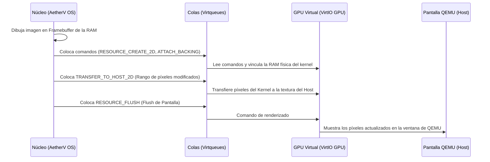

# AetherV OS - Fase 3: Hardware Drivers & I/O Subsystem (Planificación)

## 🎯 Resumen Ejecutivo
> [!abstract] Resumen
> Especificación técnica y plan de diseño para la **Fase 3: Hardware Drivers & I/O Subsystem** de AetherV OS. Define el mapeo MMIO y la inicialización de los controladores gráficos y de entrada bajo el estándar de virtualización **VirtIO** de QEMU. Establece los cimientos del Framebuffer 2D y el bus asíncrono de eventos de entrada (teclado y ratón) mediante colas de descriptores físicos (Virtqueues).

---

## 🔑 Conceptos Clave
- **[[VirtIO MMIO]]:** Interfaz de E/S mapeada en memoria (MMIO) que permite al núcleo comunicarse con dispositivos virtualizados (bloques, red, GPU, consola, input) leyendo y escribiendo en direcciones de memoria física específicas (ej. `0x10001000`–`0x10008000` en QEMU virt).
- **[[Virtqueue]]:** Estructura de datos fundamental de VirtIO que consta de una Tabla de Descriptores (Descriptor Table), un Anillo de Disponibles (Available Ring) y un Anillo de Usados (Used Ring), usada para transmitir buffers de datos de forma asíncrona entre el driver (núcleo) y el dispositivo (hipervisor/QEMU).
- **[[VirtIO GPU (Device ID 16)]]:** Dispositivo gráfico virtual que expone comandos de aceleración 2D/3D. Permite mapear regiones de RAM física del kernel como un *Framebuffer* para renderizar píxeles en una pantalla virtual.
- **[[VirtIO Input (Device ID 18)]]:** Interfaz de hardware para capturar eventos de entrada del teclado y del ratón, reportando códigos de escaneo (scancodes), desplazamientos del ratón (X/Y) y clicks a través de interrupciones externas de hardware.
- **[[PLIC (Platform Level Interrupt Controller)]]:** Unidad de hardware RISC-V que gestiona, prioriza y enruta las interrupciones externas (como las de los dispositivos VirtIO) hacia los diferentes núcleos y modos (M-Mode, S-Mode).

---

## 💡 Especificación Técnica de los Controladores VirtIO

### Módulo 1: Inicialización y Protocolo MMIO de VirtIO
Los registros MMIO de VirtIO ocupan el rango `0x1000_1000` a `0x1000_8000` en QEMU. Cada dispositivo ocupa una región de 4KB (`0x1000` bytes).

#### 1. Mapa de Registros MMIO
El layout básico de registros para cada slot MMIO se estructurará de la siguiente forma:

```rust
// En src/drivers/virtio.rs
#[repr(C)]
pub struct VirtioMmioregs {
    pub magic: u32,           // 0x00: Valor mágico "virt" (0x74726976)
    pub version: u32,         // 0x04: Versión del dispositivo (1 = Legacy, 2 = Modern)
    pub device_id: u32,       // 0x08: ID del dispositivo (ej. 16 = GPU, 18 = Input)
    pub vendor_id: u32,       // 0x0c: ID del fabricante
    pub device_features: u32, // 0x10: Características del dispositivo
    pub rsvd0: [u32; 3],      // 0x14 - 0x1c: Reservado
    pub driver_features: u32, // 0x20: Características soportadas por el driver
    pub rsvd1: [u32; 3],      // 0x24 - 0x2c: Reservado
    pub queue_sel: u32,       // 0x30: Selección de cola de transmisión (Virtqueue)
    pub queue_num_max: u32,   // 0x34: Tamaño máximo de cola soportado
    pub queue_num: u32,       // 0x38: Tamaño de cola configurado por el driver
    pub rsvd2: [u32; 2],      // 0x3c - 0x40: Reservado
    pub queue_ready: u32,     // 0x44: Indica si la cola seleccionada está lista
    pub rsvd3: [u32; 2],      // 0x48 - 0x4c: Reservado
    pub queue_notify: u32,    // 0x50: Notificar al dispositivo sobre nuevos buffers (escribir cola)
    pub rsvd4: [u32; 3],      // 0x54 - 0x5c: Reservado
    pub interrupt_status: u32,// 0x60: Estado de interrupción (lectura)
    pub interrupt_ack: u32,   // 0x64: Acknowledge de interrupción (escritura)
    pub rsvd5: [u32; 2],      // 0x68 - 0x6c: Reservado
    pub status: u32,          // 0x70: Estatus del dispositivo
    // ...
}
```

#### 2. Protocolo de Negociación y Handshake
Para inicializar cualquier dispositivo VirtIO MMIO:
1. Escribir `0` en `status` para reiniciar (Reset).
2. Escribir `ACKNOWLEDGE` (bit 0) en `status` indicando que el driver ha detectado el dispositivo.
3. Escribir `DRIVER` (bit 1) en `status` indicando que el kernel sabe cómo manejarlo.
4. Leer `device_features` y escribir las características soportadas por nuestro driver en `driver_features`.
5. Escribir `FEATURES_OK` (bit 3) en `status`.
6. Leer `status` y verificar si el bit `FEATURES_OK` se mantiene activo (si no, el hardware no es compatible).
7. Configurar colas de comunicación (`Virtqueues`).
8. Escribir `DRIVER_OK` (bit 2) en `status`. El dispositivo queda activo para E/S.

---

### Módulo 2: Cola de Descriptores (Virtqueue Structure)
Cada Virtqueue requiere memoria alineada a página (4KB) y consta de tres secciones contiguas:

```rust
// En src/drivers/virtqueue.rs

// 1. Descriptores de 16 bytes: Describen buffers de datos
#[repr(C)]
pub struct VirtqDesc {
    pub addr: u64,  // Dirección física del buffer de datos
    pub len: u32,   // Longitud del buffer
    pub flags: u16, // Flags de control (ej. 1 = NEXT, 2 = WRITE_ONLY)
    pub next: u16,  // Índice del siguiente descriptor en caso de cadena
}

// 2. Anillo de Disponibles (Available Ring): Buffers listos para que el hardware los lea
#[repr(C)]
pub struct VirtqAvail {
    pub flags: u16,
    pub idx: u16,
    pub ring: [u16; 32], // Modificar tamaño según queue_num
}

// 3. Anillo de Usados (Used Ring): Buffers que el hardware ha terminado de procesar
#[repr(C)]
pub struct VirtqUsedElem {
    pub id: u32,  // ID del descriptor inicial de la cadena procesada
    pub len: u32, // Longitud de datos escritos en el descriptor
}

#[repr(C)]
pub struct VirtqUsed {
    pub flags: u16,
    pub idx: u16,
    pub ring: [VirtqUsedElem; 32],
}
```

---

### Módulo 3: VirtIO GPU y Framebuffer 2D (`feature/05-virtio-graphics`)

El dispositivo GPU virtual se inicializa negociando características básicas y configurando la cola de control `controlq`.

#### 1. Estructura de Comandos GPU
Los comandos se envían en formato de paquetes binarios a la GPU:

```rust
// Comandos del protocolo de control GPU
pub const VIRTIO_GPU_CMD_RESOURCE_CREATE_2D: u32 = 0x0101;
pub const VIRTIO_GPU_CMD_RESOURCE_ATTACH_BACKING: u32 = 0x0106;
pub const VIRTIO_GPU_CMD_SET_SCANOUT: u32 = 0x0103;
pub const VIRTIO_GPU_CMD_TRANSFER_TO_HOST_2D: u32 = 0x0105;
pub const VIRTIO_GPU_CMD_RESOURCE_FLUSH: u32 = 0x0104;

// Cabecera común de comandos GPU
#[repr(C)]
pub struct VirtioGpuCtrlHdr {
    pub type_: u32,
    pub flags: u32,
    pub fence_id: u64,
    pub ctx_id: u32,
    pub padding: u32,
}

// Crear recurso 2D en memoria del Host (QEMU)
#[repr(C)]
pub struct GpuResourceCreate2D {
    pub hdr: VirtioGpuCtrlHdr,
    pub resource_id: u32,
    pub format: u32, // ej. 1 = B8G8R8A8_UNORM
    pub width: u32,
    pub height: u32,
}
```

#### 2. Flujo de Renderizado 2D
Para dibujar y visualizar en pantalla:
1. Reservar memoria RAM en el kernel para el Framebuffer (ej. `800x600 * 4 bytes/pixel = 1.92 MB`).
2. Enviar `RESOURCE_CREATE_2D` para crear una textura en el host.
3. Enviar `RESOURCE_ATTACH_BACKING` vinculando nuestra región de RAM asignada al recurso 2D creado.
4. Enviar `SET_SCANOUT` para ordenar a QEMU que muestre el recurso 2D en la pantalla virtual de VirtIO.
5. Dibujar en nuestra RAM (Framebuffer local).
6. Enviar `TRANSFER_TO_HOST_2D` para sincronizar los píxeles modificados al host.
7. Enviar `RESOURCE_FLUSH` para ordenar a QEMU el refresco y redibujado de la ventana de visualización.

---

### Módulo 4: Entrada y Bus de Eventos (Teclado y Ratón)

El dispositivo `VirtIO Input` requiere que el driver pre-asigne buffers vacíos en su cola de lectura. Cuando ocurre una pulsación o movimiento:
1. El hardware escribe el evento en uno de nuestros buffers disponibles.
2. El hardware genera una interrupción externa.
3. El PLIC encamina la interrupción a la CPU de Supervisor (S-mode).
4. El manejador de trampas lee el buffer procesado de la Virtqueue del dispositivo Input y lo transforma en un evento de teclado/ratón.
5. El manejador vuelve a enviar el descriptor vacío a la Virtqueue para que esté listo ante nuevos eventos de entrada.

---

## Diagramas y Esquemas

### Flujo del Buffer en una Virtqueue (Virtqueue Cycle)

```mermaid
graph LR
    subgraph Driver (Kernel Rust)
        Desc[Asignar descriptor en Descriptor Table] --> Avail[Escribir índice en Available Ring]
    end
    Avail -->|Notificar hardware (queue_notify)| QEMU[QEMU / Hypervisor procesa buffer]
    QEMU -->|Escribir resultado| Used[Escribir en Used Ring]
    Used -->|Interrupción externa| Handler[Trap Handler lee del Used Ring]
    Handler -->|Liberar descriptor| Desc
```

### Arquitectura de E/S y Renderizado Gráfico



---

## 🛠️ Acciones / Plan de Implementación de la Fase 3

- [ ] **Paso 1: Configurar y Mapear MMIO en memoria virtual**
  - [ ] Validar que las regiones MMIO `0x10001000`–`0x10008000` estén mapeadas con permisos de lectura/escritura en [paging.rs](file:///home/carlos/PARA/2-frecuente/00/AetherV/src/paging.rs) (Ya contemplado en la Fase 1).
- [ ] **Paso 2: Desarrollar el esqueleto común de VirtIO (`src/drivers/virtio.rs`)**
  - [ ] Definir los registros MMIO y el handshake de negociación de estatus.
  - [ ] Implementar la estructura física y lógica de una `Virtqueue`.
- [ ] **Paso 3: Desarrollar el controlador Gráfico (`src/drivers/gpu.rs`)**
  - [ ] Codificar las estructuras de comandos de la GPU 2D.
  - [ ] Reservar y alinear la región del Framebuffer en RAM.
  - [ ] Inicializar la pantalla y escribir un patrón de prueba (ej. degradado cromático o patrón de tablero de ajedrez).
- [ ] **Paso 4: Desarrollar el bus de eventos y controladores de entrada (`src/drivers/input.rs`)**
  - [ ] Configurar buffers y colas de recepción de eventos.
  - [ ] Habilitar y manejar interrupciones externas (PLIC) para decodificar scancodes de teclado e interactuar con el planificador de hilos.

---

## 🔗 Notas Relacionadas
- [docs/aetherv_phase2_okf.md](file:///home/carlos/PARA/2-frecuente/00/AetherV/docs/aetherv_phase2_okf.md)
- [AetherV_OS_Roadmap.md](file:///home/carlos/PARA/2-frecuente/00/AetherV/AetherV_OS_Roadmap.md)
- [src/paging.rs](file:///home/carlos/PARA/2-frecuente/00/AetherV/src/paging.rs)
- [src/trap.rs](file:///home/carlos/PARA/2-frecuente/00/AetherV/src/trap.rs)
