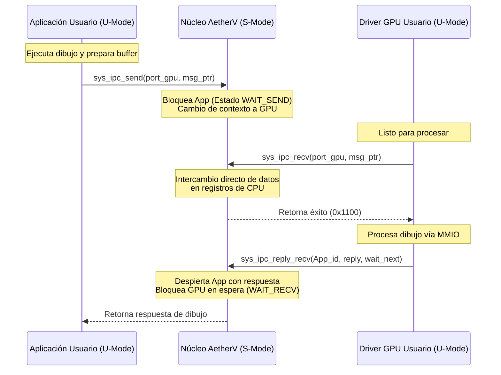

# AetherV OS - Fase 4: Modern Microkernel Evolution (Planificación)

## 🎯 Resumen Ejecutivo
> [!abstract] Resumen
> Especificación técnica y plan de diseño para la **Fase 4: Modern Microkernel Evolution** de AetherV OS (`feature/06-ipc-microkernel`). Define la transición del kernel monolítico básico hacia una arquitectura de microkernel minimalista de alto rendimiento. Establece el aislamiento de ejecución en Modo Usuario (U-Mode), un subsistema de Paso de Mensajes Síncrono y Asíncrono (IPC) rápido, y la migración de los drivers de hardware (VirtIO GPU/Input) desde el kernel a procesos de usuario aislados.

---

## 🔑 Conceptos Clave
- **[[U-Mode (User Mode)]]:** El nivel de privilegio más bajo en la arquitectura RISC-V. En este modo, las instrucciones privilegiadas están deshabilitadas y los accesos a memoria física están estrictamente controlados por las tablas de páginas (requiriendo el flag `PTE_U`).
- **[[IPC Síncrono (Rendezvous)]]:** Mecanismo de paso de mensajes donde el emisor o el receptor se bloquean mutuamente hasta que ambos están listos para la transferencia, eliminando la necesidad de colas de buffers intermedias y reduciendo la latencia de copia.
- **[[IPC Asíncrono (Notificaciones)]]:** Comunicación sin bloqueo basada en banderas de bits rápidas, utilizada por el kernel para delegar interrupciones físicas de hardware a los controladores de usuario.
- **[[User-Space Drivers]]:** Controladores de hardware que se ejecutan como procesos normales en U-Mode. Se comunican con los dispositivos mapeando regiones MMIO específicas a su tabla de páginas virtual y recibiendo interrupciones a través de notificaciones IPC del kernel.
- **[[sepc & sstatus]]:** Registros de control y estado de RISC-V usados para gestionar el retorno al espacio de usuario (`sstatus.SPP` configurado a 0) y el punto de entrada virtual (`sepc` configurado al PC de usuario).
- **[[sscratch]]:** Registro del sistema usado para almacenar temporalmente el puntero a la pila del kernel durante la ejecución en U-Mode, posibilitando salvar el contexto de usuario inmediatamente al entrar a una trampa (trap).

---

## 💡 Especificación Técnica del Microkernel e IPC

### Módulo 1: Aislamiento en U-Mode (User Space) y Cambio de Contexto

El kernel debe soportar la ejecución segura de tareas en el nivel de privilegio de usuario (U-mode), separando los espacios de memoria física y virtual.

```
       TASK CONTROL BLOCK (TCB)
┌───────────────────────────────────────┐
│ Kernel Stack Pointer (sp_kernel)       │  <── Cargado en sscratch durante U-mode
├───────────────────────────────────────┤
│ Contexto de Registros (gpregs: 32)    │  <── Guardados al ocurrir una excepción/trap
├───────────────────────────────────────┤
│ Tabla de Páginas Virtuales (satp)     │  <── Raíz Sv39 con páginas marcadas como PTE_U
└───────────────────────────────────────┘
```

#### 1. Configuración de Tablas de Páginas
* Toda página destinada al espacio de usuario (código, datos, pilas) debe poseer el bit **`PTE_U` (User)** en la entrada de la tabla de páginas de nivel 0. De lo contrario, un acceso en U-Mode provocará un fallo de página (Page Fault).
* Las páginas de código del Kernel y periféricos del sistema (como la UART de debug) no deben tener activo el flag `PTE_U` para evitar el acceso malicioso o accidental del usuario.

#### 2. Transición y Lanzamiento a Modo Usuario (S-Mode a U-Mode)
Para ejecutar un proceso en U-mode, el despachador del kernel debe realizar la transición mediante la instrucción `sret` (Supervisor Return) de la siguiente manera:
1. Configurar el registro `sstatus`:
   * Poner a 0 el bit `SPP` (Supervisor Previous Privilege) para indicar que al ejecutar `sret` la CPU debe entrar en **User Mode**.
   * Poner a 1 el bit `SPIE` (Supervisor Previous Interrupt Enable) para que las interrupciones se re-habiliten automáticamente al pasar a espacio de usuario.
2. Escribir en `sepc` la dirección virtual del punto de entrada del programa de usuario.
3. Cargar el puntero de la pila del kernel del proceso en el registro `sscratch`.
4. Cargar todos los registros generales de usuario (incluyendo el puntero de pila de usuario `sp`).
5. Ejecutar la instrucción `sret`.

---

### Módulo 2: Paso de Mensajes Inter-Procesos (IPC) de Alta Velocidad

La comunicación se estructurará sobre llamadas del sistema (syscalls) mapeadas a través de la instrucción `ecall`.

#### 1. Tipos de Llamadas de Mensajería (System Calls)
* `sys_ipc_send(dest_port, msg_ptr) -> status`: Síncrono. Bloquea al emisor hasta que el receptor llama a `recv`.
* `sys_ipc_recv(src_port, msg_ptr) -> status`: Síncrono. Bloquea al receptor hasta que llega un mensaje.
* `sys_ipc_reply_recv(dest_port, reply_msg_ptr, src_port, recv_msg_ptr) -> status`: Combina el envío de una respuesta y el bloqueo inmediato de espera del próximo mensaje en una sola operación de CPU. Esencial para servidores del sistema para ahorrar un cambio de contexto.
* `sys_ipc_notify(dest_port, bits) -> status`: Asíncrono. No bloquea. Activa una máscara de bits en el receptor, útil para señalización rápida e interrupciones.

#### 2. Estructura de Mensajes
```rust
#[repr(C)]
pub struct IpcMessage {
    pub sender: u32,       // ID del proceso emisor (rellenado por el kernel)
    pub msg_type: u32,     // Tipo/Etiqueta del mensaje
    pub length: u32,       // Tamaño del cuerpo en bytes
    pub reserved: u32,     // Alineación
    pub payload: [u8; 32], // Datos inline rápidos (Zero-Copy IPC a través de registros)
}
```

> [!tip] Optimización de Rendimiento: IPC por Registros
> Para mensajes cortos (≤ 32 bytes), el kernel evitará copiar datos entre espacios de memoria. En su lugar, el planificador transferirá el contenido directamente copiando los registros del TCB del emisor (`a2` a `a7`) a los del receptor en el momento del Rendezvous.

---

### Módulo 3: Drivers en Espacio de Usuario (User-Space Drivers)

Para garantizar la estabilidad del sistema, los controladores VirtIO GPU y VirtIO Input se extraerán del kernel y se ejecutarán como servidores independientes de usuario.

```
+-------------------------------------------------------------+
|                        USER SPACE                           |
|  +-------------------+               +-------------------+  |
|  | Aplicación Usuario|               | Driver GPU User   |  |
|  +---------┬---------+               +---------▲---------+  |
|            │ (Llamada de dibujo)               │ Mapeo MMIO |
|            │ IPC (Send)                        │ 0x10008000 |
+────────────┼───────────────────────────────────┼────────────+
|            ▼                                   │            |
|  +─────────────────────────────────────────────┴─────────+  |
|  |                   KERNEL (S-MODE)                     |  |
|  |  * Despachador de Interrupciones PLIC -> IPC Notify   |  |
|  |  * Rutas de Memoria Virtual (Sv39 con PTE_U en MMIO)  |  |
|  +-------------------------------------------------------+  |
+-------------------------------------------------------------+
```

#### 1. Mapeo de E/S en Modo Usuario (MMIO Mapped)
El kernel otorgará privilegios de hardware selectivos mapeando la página física del dispositivo VirtIO directamente en la tabla de páginas del proceso del controlador de usuario:
* **VirtIO GPU:** Mapear el rango físico `0x10008000`–`0x10009000` con flags `PTE_U | PTE_R | PTE_W`.
* El proceso driver de usuario leerá/escribirá de forma directa en los registros MMIO del dispositivo, reduciendo la sobrecarga de syscalls para operar la GPU.

#### 2. Delegación de Interrupciones Físicas a U-Mode
1. El dispositivo (ej. VirtIO Input) genera una interrupción de hardware externa.
2. El PLIC encamina la interrupción y el núcleo la intercepta en `rust_trap_handler`.
3. El kernel realiza un "Acknowledge" de la interrupción en el PLIC.
4. En lugar de procesar los registros de VirtIO, el kernel envía un `sys_ipc_notify` asíncrono con el bit de interrupción correspondiente al proceso del driver de usuario registrado.
5. El planificador despierta al driver de usuario, el cual procesa los buffers de entrada directamente mediante accesos MMIO a la Virtqueue mapeada.

---

### Módulo 4: Registro de Servicios (Service Registry / Name Server)

Para coordinar la comunicación, el sistema contará con un Servidor de Nombres centralizado (`nameserver`):

1. **Registro:** Al arrancar, el controlador GPU de usuario llama a `sys_register_service("display", port_id)`.
2. **Búsqueda:** Una aplicación cliente que requiera renderizar en pantalla llama a `sys_lookup_service("display") -> port_id`.
3. **Establecimiento de Sesión:** El cliente abre un canal IPC hacia el `port_id` obtenido y comienza a enviar comandos de dibujo estructurados en mensajes IPC.

---

## Diagramas y Esquemas

### Comunicación IPC Síncrona (Rendezvous)



---

## 🛠️ Acciones / Plan de Implementación de la Fase 4

- [x] **Paso 1: Implementar Soporte y Cambio de Contexto para U-Mode** (Completado)
  - [x] Extender el PCB de tareas (`src/task.rs`) para incluir campos IPC de canal y guardar de forma segura `tf_addr` durante interrupciones. Habilitar `SUM` (Supervisor User Memory access).
  - [x] Implementar la manipulación de `sscratch` en el salvado/restaurado de registros dentro de `src/trap.S` para alternar entre la pila del kernel y del usuario.
  - [x] Configurar mapeo duplicado simétrico con desplazamiento `-0x40000000` en Sv39 para permitir direccionamiento PC-relative transparente y acceso de U-mode a constantes en `.rodata` y datos en `.data`/BSS/heap.
- [x] **Paso 2: Desarrollar el Subsistema de Mensajería IPC** (Completado)
  - [x] Crear el despachador de llamadas del sistema de IPC (`sys_ipc_send`, `sys_ipc_recv`, `sys_ipc_reply_recv` y `sys_ipc_notify`).
  - [x] Desarrollar la lógica de bloqueo/desbloqueo de tareas (`BlockedSend`, `BlockedRecv`) en el planificador Round-Robin del kernel.
  - [x] Escribir y validar de forma exitosa en simulación de QEMU el flujo de comunicación síncrona cliente-servidor (Rendezvous con envío de `DEADBEEF` y recepción de respuesta `CAFE` entre tareas de U-Mode).
- [ ] **Paso 3: Extraer el Controlador VirtIO GPU a U-Mode**
  - [ ] Mapear la página física de la GPU con el bit `PTE_U` en el proceso del driver gráfico.
  - [ ] Migrar el código de `init()` y transferencia de buffers al ejecutable del driver de espacio de usuario.
- [ ] **Paso 4: Diseñar el Registro de Nombres del Sistema (Name Server)**
  - [ ] Programar una estructura interna de búsqueda (`BTreeMap` o `Vec`) indexando nombres de servicios contra puertos IPC activos del kernel.

---

## 🔗 Notas Relacionadas
- [docs/aetherv_phase3_okf.md](file:///home/carlos/PARA/2-frecuente/00/AetherV/docs/aetherv_phase3_okf.md)
- [AetherV_OS_Roadmap.md](file:///home/carlos/PARA/2-frecuente/00/AetherV/AetherV_OS_Roadmap.md)
- [src/task.rs](file:///home/carlos/PARA/2-frecuente/00/AetherV/src/task.rs)
- [src/trap.rs](file:///home/carlos/PARA/2-frecuente/00/AetherV/src/trap.rs)
